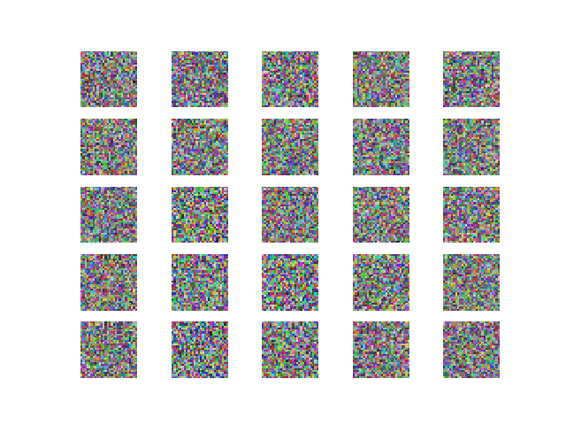

# Vanilla GAN in Keras

This is an implementation of the basic GAN algorithm using Keras based on the original GAN paper by Ian Goodfellow et al.
Paper link: https://arxiv.org/abs/1406.2661

Find the Medium post explaining the use of the code here: 

I have uploaded the dataset used in the code to my Floydhub for easy downloading. Find it here: https://www.floydhub.com/mirantha/datasets/celeba

### Instruction to sun the sript

Download the dataset from the provided link and save the images to a folder named 'data_face' in the same directory as the script

Create another foler in the same directory named 'output_images' to store the generated images

Run the code

完整的代码可以在GitHub上找到。
https://github.com/miranthajayatilake/GANwKeras

您可以参考所有用于导入RGB图像的附加代码，初始化模型并将结果记录在代码中。请注意，在训练期间，为了能够在CPU上运行，将Mini batches设置为Hi32映像。 此外，本例中使用的真实图像是来自CelebA数据集的5000张图像。这是一个开源数据集，我已经将它上传到Floydhub，以便下载，您可以在这里找到。 
https://www.floydhub.com/mirantha/datasets/celeba

有很多方法可以优化代码以获得更好的结果，并且这样可以帮助你了解算法的不同组件如何影响模型。在调整优化器，激活函数，归一化，损失损失函数，超参数等不同组件的同时观察结果是增强对算法理解的最佳方法。这里 我选择改变优化器。

因此，用32 batches训练5000 epochs，我使用三种优化算法进行了测试。使用Keras这个过程就像导入和替换优化器函数的名称一样简单。 Keras内置的所有优化器都可以在这里找到。 

此外，在每个实例中绘制的损失用于理解模型的行为。

1. 使用SGD（随机梯度下降优化器）。输出和损失变化分别如图2和3所示。

注意：虽然收敛是不平稳的，但我们可以在这里看到，生成器损失在epochs时期减少，这意味着鉴别器倾向于将假图像检测为真实。

2.使用RMSProp优化器。 输出和损失变化分别如图4和5所示。

损失：

注意：在这里，我们也看到生成模型损失在减少，这是一件好事。 令人惊讶的是，真实图像上的判别器损失增加，这非常有趣。

3. 使用Adam优化器。 输出和损耗变化分别如图6和图7所示。

注意： adam优化器产生迄今为止最好的结果。 请注意，假图像上的鉴别器损失保留较大的值，这意味着鉴别器倾向于将假图像检测为真实。
 
完整代码：
https://github.com/miranthajayatilake/GANwKeras

图像数据：
https://www.floydhub.com/mirantha/datasets/celeba

原文链接：
https://towardsdatascience.com/understanding-and-optimizing-gans-going-back-to-first-principles-e5df8835ae18
